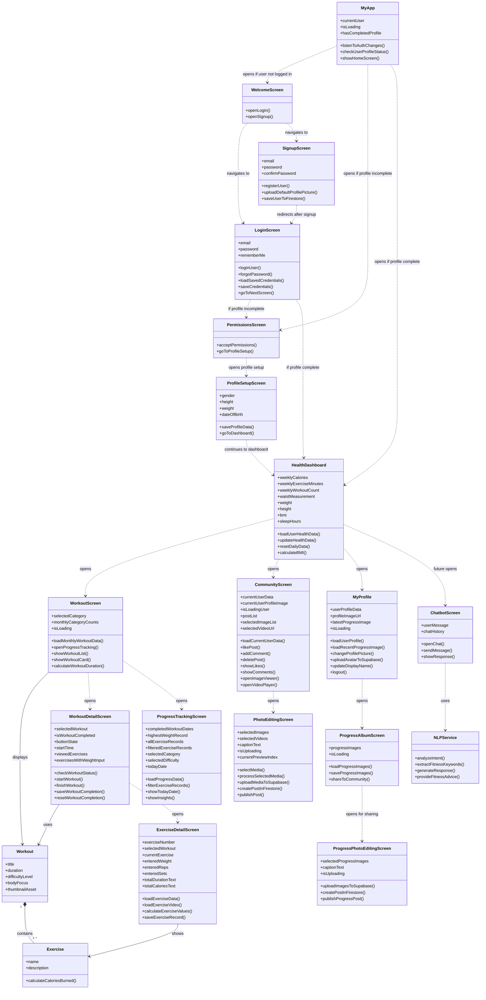

```mermaid
classDiagram
direction TB

class MyApp {
  +currentUser
  +isLoading
  +hasCompletedProfile
  +listenToAuthChanges()
  +checkUserProfileStatus()
  +showHomeScreen()
}

class WelcomeScreen {
  +openLogin()
  +openSignup()
}

class LoginScreen {
  +email
  +password
  +rememberMe
  +loginUser()
  +forgotPassword()
  +loadSavedCredentials()
  +saveCredentials()
  +goToNextScreen()
}

class SignupScreen {
  +email
  +password
  +confirmPassword
  +registerUser()
  +uploadDefaultProfilePicture()
  +saveUserToFirestore()
}

class PermissionsScreen {
  +acceptPermissions()
  +goToProfileSetup()
}

class ProfileSetupScreen {
  +gender
  +height
  +weight
  +dateOfBirth
  +saveProfileData()
  +goToDashboard()
}

class HealthDashboard {
  +weeklyCalories
  +weeklyExerciseMinutes
  +weeklyWorkoutCount
  +waistMeasurement
  +weight
  +height
  +bmi
  +sleepHours
  +loadUserHealthData()
  +updateHealthData()
  +resetDailyData()
  +calculateBMI()
}

class Workout {
  +title
  +duration
  +difficultyLevel
  +bodyFocus
  +thumbnailAsset
}

class Exercise {
  +name
  +description
  +calculateCaloriesBurned()
}

class WorkoutScreen {
  +selectedCategory
  +monthlyCategoryCounts
  +isLoading
  +loadMonthlyWorkoutData()
  +openProgressTracking()
  +showWorkoutList()
  +showWorkoutCard()
  +calculateWorkoutDuration()
}

class WorkoutDetailScreen {
  +selectedWorkout
  +isWorkoutCompleted
  +buttonState
  +startTime
  +viewedExercises
  +exercisesWithWeightInput
  +checkWorkoutStatus()
  +startWorkout()
  +finishWorkout()
  +saveWorkoutCompletion()
  +resetWorkoutCompletion()
}

class ExerciseDetailScreen {
  +exerciseNumber
  +selectedWorkout
  +currentExercise
  +enteredWeight
  +enteredReps
  +enteredSets
  +totalDurationText
  +totalCaloriesText
  +loadExerciseData()
  +loadExerciseVideo()
  +calculateExerciseValues()
  +saveExerciseRecord()
}

class ProgressTrackingScreen {
  +completedWorkoutDates
  +highestWeightRecord
  +allExerciseRecords
  +filteredExerciseRecords
  +selectedCategory
  +selectedDifficulty
  +todayDate
  +loadProgressData()
  +filterExerciseRecords()
  +showTodayDate()
  +showInsights()
}

class CommunityScreen {
  +currentUserData
  +currentUserProfileImage
  +isLoadingUser
  +postList
  +selectedImageList
  +selectedVideoUrl
  +loadCurrentUserData()
  +likePost()
  +addComment()
  +deletePost()
  +showLikes()
  +showComments()
  +openImageViewer()
  +openVideoPlayer()
}

class ChatbotScreen {
  +userMessage
  +chatHistory
  +openChat()
  +sendMessage()
  +showResponse()
}

class NLPService {
  +analyzeIntent()
  +extractFitnessKeywords()
  +generateResponse()
  +provideFitnessAdvice()
}

class ProgressAlbumScreen {
  +progressImages
  +isLoading
  +loadProgressImages()
  +saveProgressImages()
  +shareToCommunity()
}

class ProgressPhotoEditingScreen {
  +selectedProgressImages
  +captionText
  +isUploading
  +uploadImagesToSupabase()
  +createPostInFirestore()
  +publishProgressPost()
}

class PhotoEditingScreen {
  +selectedImages
  +selectedVideos
  +captionText
  +isUploading
  +currentPreviewIndex
  +selectMedia()
  +processSelectedMedia()
  +uploadMediaToSupabase()
  +createPostInFirestore()
  +publishPost()
}

class MyProfile {
  +userProfileData
  +profileImageUrl
  +latestProgressImage
  +isLoading
  +loadUserProfile()
  +loadRecentProgressImage()
  +changeProfilePicture()
  +uploadAvatarToSupabase()
  +updateDisplayName()
  +logout()
}

Workout "1" *-- "1..*" Exercise : contains
MyApp ..> WelcomeScreen : opens if user not logged in
MyApp ..> PermissionsScreen : opens if profile incomplete
MyApp ..> HealthDashboard : opens if profile complete

WelcomeScreen ..> LoginScreen : navigates to
WelcomeScreen ..> SignupScreen : navigates to
SignupScreen ..> LoginScreen : redirects after signup
LoginScreen ..> PermissionsScreen : if profile incomplete
LoginScreen ..> HealthDashboard : if profile complete
PermissionsScreen ..> ProfileSetupScreen : opens profile setup
ProfileSetupScreen ..> HealthDashboard : continues to dashboard

HealthDashboard ..> WorkoutScreen : opens
HealthDashboard ..> CommunityScreen : opens
HealthDashboard ..> MyProfile : opens
HealthDashboard ..> ChatbotScreen : future opens

WorkoutScreen --> Workout : displays
WorkoutScreen ..> WorkoutDetailScreen : opens
WorkoutScreen ..> ProgressTrackingScreen : opens
WorkoutDetailScreen --> Workout : uses
WorkoutDetailScreen ..> ExerciseDetailScreen : opens
ExerciseDetailScreen --> Exercise : shows
ChatbotScreen ..> NLPService : uses

MyProfile ..> ProgressAlbumScreen : opens
ProgressAlbumScreen ..> ProgressPhotoEditingScreen : opens for sharing
CommunityScreen ..> PhotoEditingScreen : opens
```
